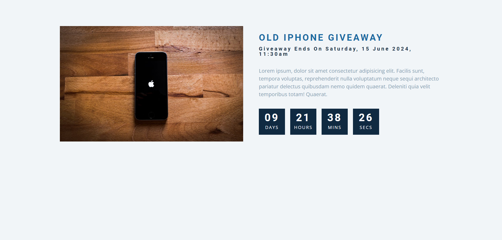

# Countdown
Hi, this repository contains a Countdown Timer web application for an Old iPhone Giveaway event, created using HTML, CSS, and JavaScript. The app displays a countdown timer to a specific date and time, indicating when the giveaway event will take place. It provides a user-friendly interface to keep participants informed about the remaining time until the event.

Built with:

  

## Output:

